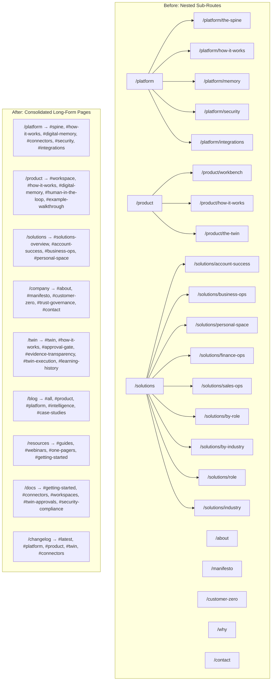

# Design Document: IntegrateWise Marketing Site Consolidation

## Overview

This design covers the consolidation of the IntegrateWise marketing site from a multi-route nested structure into a set of long-form, anchor-based pages with section navigation, redirect routes for legacy URLs, a unified CTA tracking layer, and an updated prerender pipeline.

The site already has a mature foundation: TanStack Router file-based routing, a global layout with Header/Footer/PageSubnav/HashScroll/RouteTransition, a SectionNav component with scroll-spy, content files in `src/content/`, and a rich library of reusable section components. The design leverages these existing patterns rather than introducing new dependencies.

### Key Design Goals

1. **Route consolidation**: Collapse Platform (5 sub-routes), Product (3 sub-routes), and Solutions (9 sub-routes) into single long-form pages. Consolidate About, Manifesto, Customer Zero, Why, and Contact into a `/company` page.
2. **Redirect preservation**: Legacy sub-route URLs redirect to the correct anchor on the consolidated page so existing links and bookmarks continue to work.
3. **New pages**: Ship Twin, Blog, Resources, Docs, and Changelog as complete long-form pages (most already exist in basic form).
4. **Solutions Role Matcher**: Build an interactive filter component for the Solutions page that syncs state to URL query parameters.
5. **Navigation updates**: Update `PRIMARY_NAV`, Footer links, and mega-menu items to point to consolidated anchor-based pages.
6. **CTA tracking**: Implement a lightweight, consistent tracking event layer across all CTAs.
7. **Prerender updates**: Update `scripts/prerender.mjs` to reflect the new route structure.

### Technology Stack (Existing)

- React 19 + TypeScript
- TanStack Router (file-based routing)
- Vite 7 + `@tailwindcss/vite`
- Tailwind CSS v4
- Framer Motion 12
- shadcn/ui (Radix primitives)
- Firebase Hosting
- Prerendering via `scripts/prerender.mjs`

No new runtime dependencies are introduced.

---

## Architecture

### Route Structure (Before → After)



### Redirect Strategy

Legacy sub-routes become thin redirect files that use TanStack Router's `beforeLoad` hook to redirect to the parent page with the correct hash anchor. This approach:

- Preserves SEO link equity via the prerender script (which follows redirects and saves the destination HTML at the old path)
- Keeps bookmarks and shared links working
- Requires no server-side redirect configuration

**Pattern for redirect route files:**

```typescript
// src/routes/platform.the-spine.tsx
import { createFileRoute, redirect } from "@tanstack/react-router";

export const Route = createFileRoute("/platform/the-spine")({
  beforeLoad: () => {
    throw redirect({ to: "/platform", hash: "spine" });
  },
});
```

### Page Composition Pattern

Each long-form page follows the same composition pattern already established by `platform.tsx` and `twin.tsx`:

1. **Route file** (`src/routes/<page>.tsx`): Imports content data, composes Section components, mounts a `<SectionNav>` with curated items.
2. **Content file** (`src/content/<page>-content.ts`): Exports typed arrays/objects for section data (headings, body text, card items, FAQ items, etc.).
3. **Section components**: Reuse existing components (`Section`, `Container`, `Badge`, `Reveal`, `ClosingCtaBand`, `SectionNav`, etc.).

The `PageSubnav` auto-discovery is a fallback. Pages that mount their own `<SectionNav>` (with `data-section-nav` attribute) suppress the auto-discovery, giving full control over labels and ordering.

---

## Components and Interfaces

### 1. Redirect Route Files

**Files**: `src/routes/platform.the-spine.tsx`, `platform.how-it-works.tsx`, `platform.memory.tsx`, `platform.security.tsx`, `platform.integrations.tsx`, `product.workbench.tsx`, `product.how-it-works.tsx`, `product.the-twin.tsx`, `solutions.account-success.tsx`, `solutions.business-ops.tsx`, `solutions.personal-space.tsx`, `solutions.finance-ops.tsx`, `solutions.sales-ops.tsx`, `solutions.by-role.tsx`, `solutions.by-industry.tsx`, `solutions.by-industry.$industry.tsx`, `solutions.role.tsx`, `solutions.industry.tsx`, `about.tsx`, `manifesto.tsx`, `customer-zero.tsx`, `why.tsx`, `contact.tsx`

Each file exports a single route with a `beforeLoad` that throws a `redirect` to the consolidated parent page with the appropriate `hash`. The mapping is:

| Legacy Route                       | Redirect Target                 |
| ---------------------------------- | ------------------------------- |
| `/platform/the-spine`              | `/platform#spine`               |
| `/platform/how-it-works`           | `/platform#how-it-works`        |
| `/platform/memory`                 | `/platform#digital-memory`      |
| `/platform/security`               | `/platform#security`            |
| `/platform/integrations`           | `/platform#integrations`        |
| `/product/workbench`               | `/product#workspace`            |
| `/product/how-it-works`            | `/product#how-it-works`         |
| `/product/the-twin`                | `/product#human-in-the-loop`    |
| `/solutions/account-success`       | `/solutions#account-success`    |
| `/solutions/business-ops`          | `/solutions#business-ops`       |
| `/solutions/personal-space`        | `/solutions#personal-space`     |
| `/solutions/finance-ops`           | `/solutions#business-ops`       |
| `/solutions/sales-ops`             | `/solutions#account-success`    |
| `/solutions/by-role`               | `/solutions#solutions-overview` |
| `/solutions/by-industry`           | `/solutions#solutions-overview` |
| `/solutions/by-industry/$industry` | `/solutions#solutions-overview` |
| `/solutions/role`                  | `/solutions#solutions-overview` |
| `/solutions/industry`              | `/solutions#solutions-overview` |
| `/about`                           | `/company#about`                |
| `/manifesto`                       | `/company#manifesto`            |
| `/customer-zero`                   | `/company#customer-zero`        |
| `/why`                             | `/company#customer-zero`        |
| `/contact`                         | `/company#contact`              |

### 2. Content Files

**Location**: `src/content/<page>-content.ts`

Each content file exports typed data objects consumed by the route component. This separates content from presentation and makes content easy to update without touching component logic.

**New content files to create:**

| File                               | Exports                                                                        |
| ---------------------------------- | ------------------------------------------------------------------------------ |
| `src/content/platform-content.ts`  | Already inline in `platform.tsx` — extract to content file                     |
| `src/content/product-content.ts`   | Already inline in `product.tsx` — extract to content file                      |
| `src/content/solutions-content.ts` | Solution category data, role/domain/industry filter options, use-story cards   |
| `src/content/company-content.ts`   | About, Manifesto, Customer Zero, Why, Trust & Governance, Contact section data |
| `src/content/twin-content.ts`      | Already inline in `twin.tsx` — extract to content file                         |
| `src/content/blog-content.ts`      | Blog post stubs, categories                                                    |
| `src/content/resources-content.ts` | Resource hub items by section                                                  |
| `src/content/docs-content.ts`      | Docs index items by section                                                    |
| `src/content/changelog-content.ts` | Changelog entries by month                                                     |

**Content file type pattern** (following `home-content.ts`):

```typescript
// src/content/platform-content.ts
import type { ComponentType } from "react";

export interface PlatformSection {
  id: string;
  navLabel: string;
  badge: string;
  heading: string;
  subheading: string;
}

export const PLATFORM_SECTIONS: PlatformSection[] = [
  { id: "spine", navLabel: "Spine", badge: "Spine", heading: "...", subheading: "..." },
  // ...
];
```

### 3. Solutions Role Matcher Component

**File**: `src/components/site/RoleMatcher.tsx`

An interactive filter component that lets visitors filter solution cards by Role, Domain, and Industry. Built on existing patterns (Radix Tabs for the filter dimensions, Framer Motion for transitions).

```typescript
interface RoleMatcherProps {
  /** All available solution cards */
  cards: SolutionCard[];
  /** Filter dimensions with their options */
  dimensions: FilterDimension[];
  /** Section ID for anchor linking */
  sectionId: string;
}

interface SolutionCard {
  id: string;
  title: string;
  blurb: string;
  icon: ComponentType<{ size?: number; className?: string }>;
  roles: string[]; // e.g. ["csm", "founder", "ops-lead"]
  domains: string[]; // e.g. ["account-success", "business-ops"]
  industries: string[]; // e.g. ["saas", "retail", "agency"]
}

interface FilterDimension {
  key: "role" | "domain" | "industry";
  label: string;
  options: FilterOption[];
}

interface FilterOption {
  key: string;
  label: string;
}
```

**Filter state management:**

- Uses URL search params (`?role=csm&industry=saas`) via TanStack Router's `useSearch` / `useNavigate` for shareable URLs.
- Falls back to `"all"` when no filter is selected.
- Cards that match ALL active filters are shown; when no cards match, a "No matches — try broadening your filters" message appears.
- Filter changes trigger a Framer Motion `AnimatePresence` transition on the card grid.

**Accessibility:**

- Filter pills use `role="tablist"` / `role="tab"` with `aria-selected`.
- Keyboard navigation: arrow keys move between pills, Enter/Space selects.
- Card grid uses `aria-live="polite"` to announce filter result changes.
- Focus management: after filter change, focus stays on the active pill.

### 4. CTA Tracking Utility

**File**: `src/lib/track.ts`

A lightweight tracking utility that emits events before navigation or modal actions.

```typescript
export interface TrackingEvent {
  event: "cta_click";
  label: string; // e.g. "Book a demo"
  source: string; // e.g. "Platform · hero"
  timestamp: number;
}

/**
 * Emit a CTA tracking event. Currently logs to console and pushes to
 * window.dataLayer (GTM-compatible). Can be extended to any analytics
 * provider without changing call sites.
 */
export function trackCta(label: string, source: string): void {
  const event: TrackingEvent = {
    event: "cta_click",
    label,
    source,
    timestamp: Date.now(),
  };

  // GTM / GA4 data layer
  if (typeof window !== "undefined") {
    (window as any).dataLayer = (window as any).dataLayer || [];
    (window as any).dataLayer.push(event);
  }

  if (import.meta.env.DEV) {
    console.debug("[track]", event);
  }
}
```

**Integration with existing `useDemoModal`:**

The `DemoModalProvider` already accepts a `source` string. The `trackCta` call is added inside the `open`, `openEarlyAccess`, and `openWaitlist` callbacks so every modal-opening CTA automatically emits a tracking event. For non-modal CTAs (e.g., "See how it works" anchor links), `trackCta` is called directly in the `onClick` handler.

### 5. Updated Navigation Config

**File**: `src/lib/site.ts`

Updates to existing navigation arrays:

- **`COMPANY_LINKS`**: Change `to` values from standalone routes (`/about`, `/manifesto`, etc.) to anchor links (`/company#about`, `/company#manifesto`, etc.).
- **`PRIMARY_NAV`**: Add entries for Blog, Resources, Docs, and Changelog as simple `kind: "link"` items. Solutions remains a `kind: "link"` item.
- **Footer links**: Update the Solutions column to use anchor links (`/solutions#account-success`, etc.) and the Company column to use `/company#about`, `/company#manifesto`, etc.

### 6. Updated Prerender Script

**File**: `scripts/prerender.mjs`

The `ROUTES` array is updated to reflect the new structure:

```javascript
const ROUTES = [
  "/",
  "/platform",
  "/product",
  "/twin",
  "/solutions",
  "/company",
  "/blog",
  "/resources",
  "/docs",
  "/changelog",
  "/pricing",

  // Legacy redirect routes — prerender follows the redirect and saves
  // the destination HTML at the old path for SEO continuity.
  "/platform/the-spine",
  "/platform/how-it-works",
  "/platform/memory",
  "/platform/security",
  "/platform/integrations",
  "/product/workbench",
  "/product/how-it-works",
  "/product/the-twin",
  "/solutions/account-success",
  "/solutions/business-ops",
  "/solutions/personal-space",
  "/about",
  "/manifesto",
  "/customer-zero",
  "/why",
  "/contact",
];
```

The existing redirect-following logic in the prerender script already handles this pattern — it follows the redirect and saves the destination HTML at the requested path.

---

## Data Models

### Content Type Definitions

All content types are defined as TypeScript interfaces in their respective content files. No database or external data store is involved — all content is static TypeScript data compiled into the bundle.

**Core shared types** (already exist or follow existing patterns):

```typescript
// Shared across content files
interface SectionMeta {
  id: string; // HTML section id for anchor linking
  navLabel: string; // Label shown in SectionNav
  badge: string; // Badge text above section heading
  heading: string; // Section h2 text
  subheading: string; // Section description text
}

interface CardItem {
  title: string;
  body: string;
  icon: ComponentType<{ size?: number; className?: string }>;
}
```

**Solutions-specific types:**

```typescript
interface SolutionCard {
  id: string;
  title: string;
  blurb: string;
  icon: ComponentType<{ size?: number; className?: string }>;
  roles: string[];
  domains: string[];
  industries: string[];
  waitlist?: boolean;
}

interface FilterDimension {
  key: "role" | "domain" | "industry";
  label: string;
  options: { key: string; label: string }[];
}
```

**Blog/Changelog types:**

```typescript
interface BlogPost {
  slug: string;
  title: string;
  summary: string;
  category: string; // maps to section id
  audience: string; // e.g. "For CSMs and Account Success leads"
}

interface ChangelogEntry {
  tags: string[]; // e.g. ["Workspace", "Account Success"]
  title: string;
  what: string;
  why: string;
  where?: string;
}

interface ChangelogMonth {
  month: string; // e.g. "April 2026"
  entries: ChangelogEntry[];
}
```

**Tracking event type:**

```typescript
interface TrackingEvent {
  event: "cta_click";
  label: string;
  source: string;
  timestamp: number;
}
```

### URL State (Solutions Filters)

Filter state for the Solutions Role Matcher is stored in URL search parameters via TanStack Router's search param validation:

```typescript
// In solutions route
export const Route = createFileRoute("/solutions")({
  validateSearch: (search: Record<string, unknown>) => ({
    role: (search.role as string) || "all",
    domain: (search.domain as string) || "all",
    industry: (search.industry as string) || "all",
  }),
  // ...
});
```

This replaces the existing hash-based filter approach in `solutions-filter-context.tsx` with search params, which are more appropriate for multi-dimensional filtering (hash is reserved for section anchors).

---

## Correctness Properties

_A property is a characteristic or behavior that should hold true across all valid executions of a system — essentially, a formal statement about what the system should do. Properties serve as the bridge between human-readable specifications and machine-verifiable correctness guarantees._

### Property 1: Redirect mapping correctness

_For any_ entry in the unified redirect map (covering Platform, Product, Solutions, and Company legacy routes), invoking the route's `beforeLoad` function should throw a TanStack Router `redirect` to the correct target path and hash anchor as defined in the map.

**Validates: Requirements 1.3, 2.3, 3.3, 4.3**

### Property 2: Content card field completeness

_For any_ valid content item (BlogPost or ChangelogEntry), rendering the item through its card component should produce output that contains the item's title and all other required display fields (summary and category for blog posts; tags, what-changed, and why-it-matters for changelog entries).

**Validates: Requirements 6.4, 9.4**

### Property 3: CTA tracking event emission

_For any_ CTA label string and source location string, calling `trackCta(label, source)` should push exactly one event to `window.dataLayer` where the event's `label` field equals the input label, the `source` field equals the input source, and the `event` field equals `"cta_click"`.

**Validates: Requirements 10.4, 14.1**

### Property 4: Solutions filter logic correctness

_For any_ set of SolutionCard objects and any combination of role, domain, and industry filter values, the `filterCards` function should return only cards whose `roles` array includes the selected role (or role is `"all"`), whose `domains` array includes the selected domain (or domain is `"all"`), and whose `industries` array includes the selected industry (or industry is `"all"`). No card that fails any active filter should appear in the result.

**Validates: Requirements 18.3**

### Property 5: Filter state URL round-trip

_For any_ valid filter state object `{ role, domain, industry }` where each value is either `"all"` or a non-empty alphanumeric-with-hyphens string, serializing the state to URL search parameters and then parsing those parameters back should produce an equivalent filter state object.

**Validates: Requirements 18.4**

---

## Error Handling

### Redirect Routes

- If a legacy sub-route's `beforeLoad` throws a redirect and the target page fails to load, TanStack Router's error boundary (the `notFoundComponent` in `__root.tsx`) catches the error and displays the 404 page.
- The prerender script already handles redirect responses by following them and saving the destination HTML. If the destination also fails, the script logs the route and increments the failure counter.

### Solutions Filter

- If URL search params contain an invalid filter key (not in the known options), the `validateSearch` function defaults to `"all"` — no error is thrown, the user sees all cards.
- If no cards match the active filters, the RoleMatcher displays a "No matches found — try broadening your filters" message with a button to reset all filters to `"all"`.

### CTA Tracking

- `trackCta` is fire-and-forget. If `window.dataLayer` doesn't exist, it creates it. If the push fails for any reason, the error is silently caught so it never blocks navigation or modal opening.
- In development mode (`import.meta.env.DEV`), events are also logged to `console.debug` for debugging.

### Prerender Script

- The existing prerender script already handles failures gracefully: it logs the failing route, increments a failure counter, and continues with remaining routes.
- The script exits with a non-zero status code only if ALL routes fail (`fail > 0 && ok === 0`). This is updated to exit non-zero if ANY route fails, per Requirement 17.2.

### Content Files

- Content files are statically typed TypeScript. Missing or malformed content causes a compile-time error, not a runtime error.
- If a content array is empty (e.g., no blog posts), the page renders the section heading with an empty state message rather than crashing.

---

## Testing Strategy

### Unit Tests (Example-Based)

Unit tests cover specific rendering and behavior scenarios:

1. **Page section presence**: For each long-form page (Platform, Product, Solutions, Company, Twin, Blog, Resources, Docs, Changelog), render the route component and assert that all expected `section[id]` elements are present.
2. **SectionNav rendering**: For each long-form page, verify the SectionNav component renders with the correct items.
3. **Accessibility attributes**: Verify ARIA attributes on SectionNav mobile dropdown, Header mobile menu, and RoleMatcher filter pills.
4. **RoleMatcher dimensions**: Verify the RoleMatcher renders three filter dimensions (Role, Domain, Industry).
5. **Empty filter state**: Verify the "no matches" message appears when filters produce zero results.
6. **Footer link correctness**: Verify each Footer link points to the correct anchor path.
7. **Header nav items**: Verify the Header renders all expected navigation items.
8. **Tracking event order**: Verify `trackCta` is called before the modal open callback.

### Property-Based Tests

Property-based tests verify universal properties across generated inputs. Each test runs a minimum of 100 iterations.

**Library**: `fast-check` (the standard PBT library for TypeScript/JavaScript)

| Property   | Test Description                                                                                                                 | Tag                                                                                   |
| ---------- | -------------------------------------------------------------------------------------------------------------------------------- | ------------------------------------------------------------------------------------- |
| Property 1 | Generate random entries from the redirect map; verify each produces the correct redirect                                         | Feature: integratewise-marketing-site, Property 1: Redirect mapping correctness       |
| Property 2 | Generate random BlogPost and ChangelogEntry objects; render through card components; verify all required fields appear in output | Feature: integratewise-marketing-site, Property 2: Content card field completeness    |
| Property 3 | Generate random label and source strings; call trackCta; verify dataLayer contains the correct event                             | Feature: integratewise-marketing-site, Property 3: CTA tracking event emission        |
| Property 4 | Generate random sets of SolutionCards and random filter combinations; verify filterCards returns only matching cards             | Feature: integratewise-marketing-site, Property 4: Solutions filter logic correctness |
| Property 5 | Generate random filter state objects; serialize to URL params; parse back; verify equivalence                                    | Feature: integratewise-marketing-site, Property 5: Filter state URL round-trip        |

### Integration Tests

Integration tests verify browser-level behavior:

1. **Scroll-spy behavior**: Scroll through a long-form page and verify SectionNav active state changes.
2. **Hash navigation**: Navigate to a URL with a hash and verify the page scrolls to the correct section.
3. **Prerender output**: Run the prerender script and verify HTML files exist for all routes.
4. **Redirect following**: Navigate to a legacy sub-route and verify the browser ends up at the correct anchor on the consolidated page.

### Test Configuration

- **Unit tests**: Vitest with React Testing Library
- **Property tests**: Vitest + fast-check, minimum 100 iterations per property
- **Integration tests**: Playwright (already in devDependencies)
- Each property test is tagged with a comment referencing the design property:
  ```typescript
  // Feature: integratewise-marketing-site, Property 1: Redirect mapping correctness
  ```
